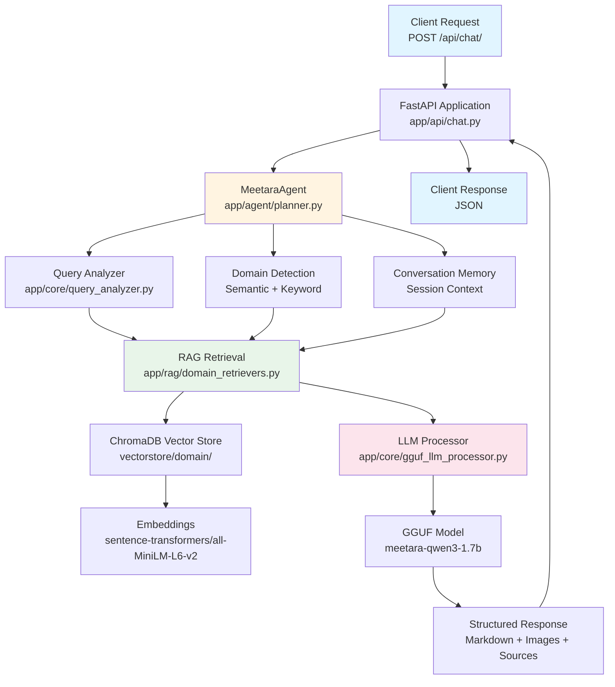
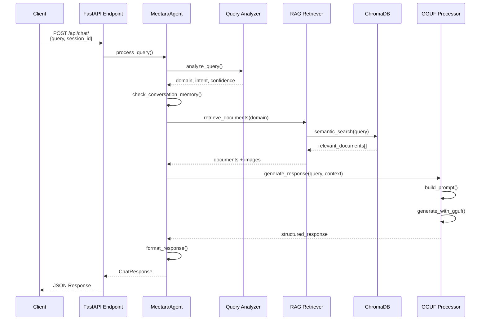
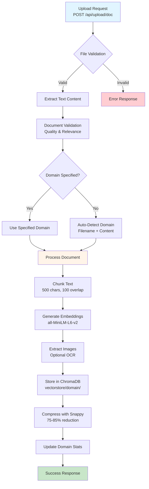
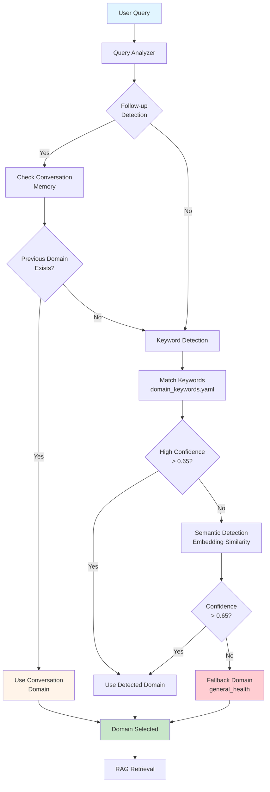
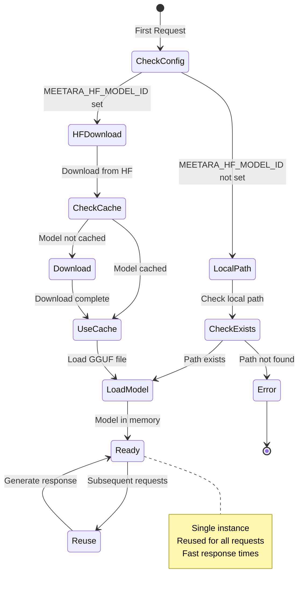

# 🏗️ Meetara Core Architecture

Complete system architecture documentation for Meetara Core RAG backend.

---

## 📋 Table of Contents

- [System Overview](#system-overview)
- [Architecture Diagram](#architecture-diagram)
- [Core Components](#core-components)
- [Data Flow](#data-flow)
- [Domain Detection System](#domain-detection-system)
- [RAG Pipeline](#rag-pipeline)
- [Model Management](#model-management)
- [Storage Architecture](#storage-architecture)
- [API Layer](#api-layer)
- [Agent System](#agent-system)

---

## 🎯 System Overview

Meetara Core is a **production-ready RAG (Retrieval-Augmented Generation) backend** that provides intelligent, domain-aware responses using:

- **Vector Search** (ChromaDB) for document retrieval
- **Fine-tuned GGUF Models** for response generation
- **Multi-Domain Support** (100+ domains)
- **Emotion-Aware Processing** for adaptive responses
- **Conversation Context** for multi-turn interactions

### Key Design Principles

1. **Config-Driven**: All domain logic via YAML files (no hardcoding)
2. **Offline-First**: All processing done locally
3. **Modular**: Extensible architecture with clear separation of concerns
4. **Performance**: Single-instance model loading, caching, parallel operations

---

## 🏛️ Architecture Diagram

### System Flow (Mermaid)



### Request Processing Flow (Mermaid)



### Document Upload Flow (Mermaid)



### Domain Detection Flow (Mermaid)



### Model Loading Flow (Mermaid)



---

## 🔧 Core Components

### 1. API Layer (`app/api/`)

**Purpose**: FastAPI route handlers for HTTP endpoints

**Key Files**:
- `chat.py` - Main chat endpoint with RAG integration
- `emotion.py` - Emotion detection APIs
- `upload.py` - Document upload and management
- `image_generation.py` - Image generation API

**Responsibilities**:
- Request validation (Pydantic models)
- Response formatting
- Error handling and logging
- CORS configuration

### 2. Agent System (`app/agent/`)

**Purpose**: LangChain-based agent orchestration

**Key Files**:
- `planner.py` - Main agent orchestrator (MeetaraAgent)
- `mcp_router.py` - Multi-component planner router
- `tools/` - Agent tools (translation, speech, emotion, etc.)

**MeetaraAgent Responsibilities**:
- Query analysis and intent detection
- Domain detection (keyword + semantic)
- Conversation memory management
- Tool orchestration
- Response generation coordination

### 3. RAG System (`app/rag/`)

**Purpose**: Vector search and document retrieval

**Key Files**:
- `domain_retrievers.py` - Domain-specific vector retrievers
- `semantic_domain_detector.py` - Semantic domain detection
- `vector_loader.py` - Vector store management

**DomainRetriever Responsibilities**:
- Per-domain ChromaDB collections
- Semantic search with embeddings
- Relevance scoring and filtering
- Image extraction from documents
- Document chunking and storage

### 4. Core Utilities (`app/core/`)

**Purpose**: Core functionality and configuration

**Key Files**:
- `config.py` - Application settings (Pydantic)
- `gguf_llm_processor.py` - GGUF model processor
- `llm_processor.py` - LLM integration layer
- `query_analyzer.py` - Query analysis and domain detection
- `domain_categorizer.py` - Domain categorization
- `config_loader.py` - YAML configuration loader
- `logger.py` - Logging system
- `security.py` - Security and validation

### 5. Configuration (`config/`)

**Purpose**: Config-driven domain management

**Key Files**:
- `domain_config.yaml` - Domain definitions and settings
- `domain_keywords.yaml` - Domain keywords for detection
- `tier_config.yaml` - Domain tier configurations

**Design**: All domain logic is config-driven - no code changes needed to add domains!

---

## 🔄 Data Flow

### Request Processing Flow

See [Request Processing Flow (Mermaid)](#request-processing-flow-mermaid) diagram above for visual representation.

**Step-by-step process:**

1. **Client Request**
   - `POST /api/chat/`
   - Payload: `{query, session_id, context}`

2. **FastAPI Endpoint** (`chat.py`)
   - Validate request (Pydantic models)
   - Extract parameters
   - Call MeetaraAgent

3. **MeetaraAgent** (`planner.py`)
   - Analyze query (QueryAnalyzer)
   - Detect domain (keyword + semantic)
   - Check conversation memory
   - Route to domain retriever

4. **Domain Retriever** (`domain_retrievers.py`)
   - Load domain-specific ChromaDB
   - Perform semantic search
   - Retrieve relevant documents
   - Extract associated images

5. **LLM Processor** (`gguf_llm_processor.py`)
   - Build prompt with RAG context
   - Generate response (GGUF model)
   - Validate response structure

6. **Response Formatting**
   - Format markdown
   - Attach images
   - Add source documents
   - Return JSON response

### Document Upload Flow

See [Document Upload Flow (Mermaid)](#document-upload-flow-mermaid) diagram above for visual representation.

**Step-by-step process:**

1. **Upload Request**
   - `POST /api/upload/doc`
   - File: `document.pdf`
   - Domain: `general_health` (optional)

2. **Document Processing**
   - Extract text (PDF, Word, Markdown, Text)
   - Extract images (if enabled)
   - Chunk text (500 chars, 100 overlap)

3. **Embedding Generation**
   - Generate embeddings (`all-MiniLM-L6-v2`)
   - Store in ChromaDB
   - Compress with Snappy (75-85% reduction)

4. **Storage**
   - Save to `vectorstore/{domain}/`
   - Update domain statistics
   - Return success response

---

## 🎯 Domain Detection System

### Two-Stage Detection

**Stage 1: Keyword Detection** (`query_analyzer.py`)
- Exact keyword matching from `domain_keywords.yaml`
- N-gram matching for phrases
- Context-aware filtering (prevents false positives)
- Cross-domain uniqueness scoring

**Stage 2: Semantic Detection** (`semantic_domain_detector.py`)
- Embedding-based similarity search
- Fallback when keyword detection is uncertain
- Confidence scoring

### Conversation Context

**Follow-up Detection**:
- Short queries (< 14 words, < 120 chars)
- Low confidence semantic detection (< 0.65)
- Previous domain in conversation memory

**Domain Override**:
- If follow-up detected AND previous domain exists
- Override semantic detection with conversation domain
- Maintains context across multi-turn conversations

### Configuration

All detection logic is config-driven:
- `config/domain_keywords.yaml` - Keywords per domain
- `config/domain_config.yaml` - Domain settings and tiers
- `config/tier_config.yaml` - Tier-based priority

---

## 🔍 RAG Pipeline

### Document Processing

1. **Text Extraction**
   - PDF: PyPDF2/pypdf
   - Word: python-docx
   - Markdown: Direct parsing
   - Text: Direct reading

2. **Image Extraction** (optional)
   - Extract images from PDFs
   - OCR with Tesseract (if enabled)
   - Store in `images/{domain}/`
   - Link to document chunks

3. **Chunking**
   - Size: 500 characters (configurable)
   - Overlap: 100 characters (configurable)
   - Recursive character splitter
   - Preserve document metadata

4. **Embedding Generation**
   - Model: `sentence-transformers/all-MiniLM-L6-v2`
   - Single shared instance (thread-safe)
   - Dimension: 384
   - Cached for performance

5. **Storage**
   - ChromaDB per domain
   - Snappy compression (75-85% reduction)
   - Metadata preservation
   - Indexed for fast retrieval

### Query Processing

1. **Query Analysis**
   - Extract key terms
   - Detect domain
   - Check conversation context

2. **Vector Search**
   - Domain-specific ChromaDB collection
   - Semantic similarity search
   - Top-K retrieval (default: 5)

3. **Relevance Filtering**
   - Score documents by relevance
   - Filter low-relevance results
   - Merge with conversation history

4. **Context Building**
   - Combine RAG documents
   - Add conversation history
   - Include associated images
   - Build LLM prompt

---

## 🤖 Model Management

### GGUF Model Processor

**Location**: `app/core/gguf_llm_processor.py`

**Features**:
- **Hugging Face Integration**: Automatic download and caching
- **Lazy Loading**: Models load only when first needed
- **Single Instance**: One model instance reused for all requests
- **Caching**: Standard HF cache location (`~/.cache/huggingface/hub`)

**Model Loading Flow**:
```
1. Check Hugging Face model ID (MEETARA_HF_MODEL_ID)
   │
   ├─→ If set: Download from HF (one-time, cached)
   │
   └─→ If not: Use local model path (MEETARA_MODELS_PATH)
   │
   ▼
2. Load model into memory (first request only)
   • Load GGUF file
   • Initialize Llama instance
   • Cache in memory
   │
   ▼
3. Reuse for all subsequent requests
   • Same model instance
   • No reloading
   • Fast response times
```

### Model Configuration

**Environment Variables**:
```env
# Hugging Face (recommended)
MEETARA_HF_MODEL_ID=meetara-lab/meetara-qwen3-1.7b-gguf
MEETARA_HF_MODEL_FILE=meetara-qwen3-1.7b-Q4_K_M.gguf

# Local (fallback)
MEETARA_MODELS_PATH=C:/path/to/models
MEETARA_INSTRUCT_MODEL=meetara-qwen3-1.7b-Q4_K_M.gguf
```

### Performance

- **First Request**: ~2-3 minutes (download + load)
- **Subsequent Requests**: ~30-35 seconds (generation only)
- **Model Size**: ~1.2 GB (Q4_K_M quantization)
- **Memory**: ~2-3 GB RAM per model instance

### Response Post-Processing

**Location**: `app/core/gguf_llm_processor.py` → `generate_response()`

The LLM response goes through extensive post-processing to ensure clean, user-friendly output:

1. **Remove Internal Thinking**: Strips `<think>`, `<reasoning>`, `<thinking>` tags and blocks
2. **Remove Meta-Commentary**: Filters patterns like:
   - "Okay, the user is asking...", "Let me think..."
   - "Wait, the user's question is about..."
   - "I should present...", "The context mentions..."
   - "Each section must have...", "The sources are..."
3. **Remove Placeholders**: Cleans `[Your Title]`, `[2-3 sentences...]` template text
4. **Normalize Formatting**: Ensures consistent markdown structure
5. **Validate Structure**: Ensures proper section headers and Sources section
6. **Truncate After Sources**: Removes any text after the Sources section to prevent thinking leakage
7. **Deduplicate Sources**: Combines duplicate source files and consolidates page numbers

This ensures users see clean, professional responses without model "thinking out loud" - similar to how industry AI assistants (like Cursor AI) process internally but only show final answers.

### Frontend Loading Indicator

**Location**: `meetara-ui/src/components/LoadingIndicator.tsx`

The frontend displays a "me²TARA Thinking" indicator with user-friendly progress steps:

| Step | Icon | Label | Backend Process |
|------|------|-------|-----------------|
| 1 | 🔍 | Knowledge Search | Domain detection + Vector similarity search |
| 2 | 📚 | Expert Sources | Retrieve top-k relevant document chunks |
| 3 | 🧠 | Analysis | LLM processes context + question |
| 4 | ✨ | Response | Format and return structured answer |

**Rotating Messages** (every 2.5 seconds):
- "Understanding your question"
- "Searching me²TARA knowledge base"
- "Finding relevant information"
- "Analyzing expert sources"
- "Preparing personalized response"

This provides users with a sense of progress without exposing technical jargon.

### Model Selection API

**Endpoint**: `GET /api/models/`

Returns all configured models with their status:
```json
{
  "default_model": "meetara-qwen3-1.7b-gguf",
  "available_models": [
    {
      "name": "meetara-qwen3-1.7b-gguf",
      "description": "Small, fast instruction-tuned model",
      "is_loaded": true,
      "is_available_locally": true
    },
    {
      "name": "meetara-qwen3-4b-instruct-gguf",
      "description": "Medium instruction-tuned model",
      "is_loaded": false,
      "is_available_locally": true
    }
  ]
}
```

**Configuration**: Models are defined in `config/model_config.yaml`

---

## 💾 Storage Architecture

### Vector Stores

**Structure**:
```
vectorstore/
├── general_health/
│   ├── chroma.sqlite3
│   ├── chroma.sqlite3-shm
│   ├── chroma.sqlite3-wal
│   └── [embedding files]
├── academic_tutoring/
│   └── [same structure]
└── [other domains]/
```

**Features**:
- **Per-Domain Isolation**: Separate ChromaDB per domain
- **Snappy Compression**: 75-85% storage reduction
- **Metadata Preservation**: Document source, page numbers, etc.
- **Thread-Safe**: Concurrent access supported

### Image Storage

**Structure**:
```
images/
├── general_health/
│   ├── doc1_page1.png
│   ├── doc1_page2.png
│   └── [extracted images]
├── academic_tutoring/
│   └── [domain-specific images]
└── generated/
    └── [AI-generated images]
```

**Features**:
- **Per-Domain Organization**: Images organized by domain
- **Linked to Documents**: Images linked to document chunks
- **OCR Support**: Optional Tesseract OCR for text extraction
- **Served via API**: `/api/images/{domain}/{filename}`

### Configuration Storage

**YAML Files** (`config/`):
- `domain_config.yaml` - Domain definitions
- `domain_keywords.yaml` - Detection keywords
- `tier_config.yaml` - Tier configurations

**Environment** (`.env`):
- API configuration
- Model paths
- Feature flags
- Logging settings

---

## 🌐 API Layer

### Endpoints

**Chat**:
- `POST /api/chat/` - Main chat endpoint with RAG (accepts optional `model` parameter)
- `GET /api/chat/domains` - List available domains
- `GET /api/chat/domains/categorized` - Domains by category
- `GET /api/chat/domains/keywords` - Domain keywords for client-side detection

**Models** (NEW):
- `GET /api/models/` - List all available LLM models with status

**Upload**:
- `POST /api/upload/doc` - Upload single document
- `POST /api/upload/batch` - Batch upload
- `POST /api/upload/domain` - Domain management

**Emotion**:
- `POST /api/emotion/detect-face-emotion` - Facial emotion
- `POST /api/emotion/detect-speech-emotion` - Speech emotion

**Vector Store**:
- `GET /api/vectorstore/all` - All domain stats
- `GET /api/vectorstore/{domain}` - Domain-specific stats

**Health**:
- `GET /health` - System health check
- `GET /` - API information

### Request/Response Models

**Chat Request**:
```python
{
  "query": str,
  "session_id": str,  # For conversation memory
  "model": Optional[str],  # Specific model to use (e.g., "meetara-qwen3-4b-instruct-gguf")
  "context": {
    "domain": Optional[str],
    "lang": Optional[str],
    "emotion": Optional[str]
  }
}
```

**Chat Response**:
```python
{
  "response": str,  # Formatted markdown
  "domain": str,
  "confidence": float,
  "images": List[Dict],
  "sources": List[str],
  "response_timestamp": str
}
```

---

## 🛠️ Agent System

### LangChain Integration

**MeetaraAgent** (`app/agent/planner.py`):
- Main orchestrator for query processing
- Tool-based architecture
- Conversation memory management
- Domain detection coordination

### Tools

**Available Tools** (`app/agent/tools/`):
1. **AdapterSelectorTool** - Domain routing
2. **TranslationTool** - Multi-language support
3. **SpeechTool** - STT/TTS integration
4. **EmotionTool** - Speech emotion detection
5. **FaceEmotionTool** - Facial emotion detection

### MCP Router

**Purpose**: Multi-component planner for emotion-aware responses

**Flow**:
```
Query → Domain Context → Emotion Context → Combined Context → Response
```

---

## 🔐 Security & Validation

### Input Validation

- **Pydantic Models**: Request validation
- **XSS Protection**: Input sanitization
- **File Validation**: Secure file upload handling
- **PII Redaction**: Automatic privacy protection in logs

### CORS Configuration

- Configurable origins via `CORS_ORIGINS`
- Credentials support
- Method and header control

### Error Handling

- Comprehensive error logging
- Graceful fallbacks
- User-friendly error messages
- Security-conscious error details

---

## 📊 Performance Optimizations

### Caching

- **Model Caching**: Single-instance model loading
- **Embedding Cache**: LRU cache for query results
- **PDF Cache**: Cached PDF paths and page text
- **HF Cache**: Standard Hugging Face cache

### Parallel Operations

- **Thread-Safe**: Concurrent access to vector stores
- **Shared Embeddings**: Single embeddings model instance
- **Batch Operations**: Batch API endpoints

### Compression

- **Snappy Compression**: 75-85% storage reduction
- **Binary Storage**: Optimized vector format
- **Efficient Chunking**: Optimal chunk sizes

---

## 🔄 Extension Points

### Adding a New Domain

1. Add to `config/domain_config.yaml`
2. Add keywords to `config/domain_keywords.yaml`
3. Upload documents via API
4. **No code changes needed!**

### Adding a New Tool

1. Create tool in `app/agent/tools/`
2. Inherit from `BaseTool`
3. Implement `_run()` and `_arun()`
4. Add to agent in `app/agent/planner.py`

### Custom Model Integration

1. Update `app/core/gguf_llm_processor.py`
2. Add model loading logic
3. Update configuration
4. Test with domain queries

---

## 📈 Scalability Considerations

### Horizontal Scaling

- **Stateless API**: Can run multiple instances
- **Shared Vector Stores**: Use network storage (NFS, S3)
- **Load Balancing**: Distribute requests across instances

### Vertical Scaling

- **Model Loading**: Single instance per server
- **Memory**: 8GB+ RAM recommended
- **CPU**: Multi-core for parallel operations

### Storage Scaling

- **ChromaDB**: Handles 100K+ documents efficiently
- **Compression**: Snappy reduces storage by 75-85%
- **Domain Isolation**: Separate stores per domain

---

## 🎯 Future Enhancements

### Planned Features

- **GPU Acceleration**: CUDA support for faster inference
- **Distributed Vector Stores**: Multi-node ChromaDB
- **Advanced Caching**: Redis integration
- **Monitoring**: Prometheus metrics
- **Streaming Responses**: Real-time response streaming

---

---

## 📤 Document Upload Guide

### Upload Methods

Meetara Core supports multiple ways to upload PDFs and other documents:

#### 1. **Command Line Upload (cURL)**

**Single Document Upload:**
```bash
curl -X POST "http://localhost:8000/api/upload/doc" \
  -F "file=@/path/to/document.pdf" \
  -F "domain=general_health" \
  -F "metadata={\"source\": \"manual\", \"author\": \"Dr. Smith\"}"
```

**Auto-Detect Domain:**
```bash
curl -X POST "http://localhost:8000/api/upload/doc" \
  -F "file=@/path/to/document.pdf"
```

**Response:**
```json
{
  "success": true,
  "message": "Document uploaded successfully",
  "domain": "general_health",
  "documents_added": 1,
  "file_info": {
    "filename": "document.pdf",
    "size": 1024000,
    "chunks": 45
  }
}
```

#### 2. **Python Script Upload**

**Using Batch Uploader Script:**
```bash
# Upload single file
python scripts/batch_uploader.py --file document.pdf --domain general_health

# Upload all PDFs from directory
python scripts/batch_uploader.py --source-dir downloads/healthcare --domain general_health

# Auto-detect domain for each file
python scripts/batch_uploader.py --source-dir downloads/ --auto-detect

# Upload specific file with auto-detection
python scripts/batch_uploader.py --file document.pdf --auto-detect
```

**Using Python API Client:**
```python
import requests

url = "http://localhost:8000/api/upload/doc"
files = {"file": open("document.pdf", "rb")}
data = {"domain": "general_health"}

response = requests.post(url, files=files, data=data)
print(response.json())
```

#### 3. **UI Upload (Swagger)**

1. **Open Swagger UI**: http://localhost:8000/docs
2. **Navigate to**: `/api/upload/doc` endpoint
3. **Click**: "Try it out"
4. **Upload File**: Click "Choose File" and select PDF
5. **Set Domain**: Enter domain name (optional)
6. **Execute**: Click "Execute"
7. **View Response**: See upload status and details

#### 4. **Batch Upload**

**Via API:**
```bash
curl -X POST "http://localhost:8000/api/upload/batch" \
  -F "domain=general_health" \
  -F "directory_path=/path/to/documents"
```

**Via Script:**
```bash
python scripts/batch_uploader.py \
  --source-dir downloads/healthcare \
  --domain general_health
```

### Supported File Types

- **PDF** (`.pdf`) - Full text and image extraction
- **Word** (`.docx`, `.doc`) - Text extraction
- **Markdown** (`.md`) - Direct parsing
- **Text** (`.txt`) - Direct reading

### Upload Features

- **Auto-Domain Detection**: Analyzes filename and content
- **Image Extraction**: Automatically extracts images from PDFs
- **OCR Support**: Optional Tesseract OCR for scanned PDFs
- **Validation**: Quality and relevance scoring
- **Compression**: Snappy compression (75-85% reduction)
- **Metadata**: Custom metadata support

### Upload Examples

**Example 1: Upload Health Document**
```bash
curl -X POST "http://localhost:8000/api/upload/doc" \
  -F "file=@health_guide.pdf" \
  -F "domain=general_health"
```

**Example 2: Upload Academic Document**
```bash
curl -X POST "http://localhost:8000/api/upload/doc" \
  -F "file=@study_guide.pdf" \
  -F "domain=academic_tutoring"
```

**Example 3: Batch Upload Multiple Domains**
```bash
# Upload healthcare documents
python scripts/batch_uploader.py --source-dir downloads/healthcare --domain general_health

# Upload education documents
python scripts/batch_uploader.py --source-dir downloads/education --domain academic_tutoring
```

### Upload Status Check

**Check Domain Statistics:**
```bash
curl http://localhost:8000/api/vectorstore/general_health
```

**Response:**
```json
{
  "domain": "general_health",
  "document_count": 15,
  "total_chunks": 1250,
  "embedding_model": "sentence-transformers/all-MiniLM-L6-v2"
}
```

### Troubleshooting Uploads

**File Too Large:**
- Maximum file size: 500MB (configurable)
- Split large PDFs or use batch upload

**Domain Not Found:**
- Check domain exists in `config/domain_config.yaml`
- Use auto-detection if domain unknown

**Upload Fails:**
- Check file format is supported
- Verify server is running
- Check logs: `logs/meetara.log`

---

**Last Updated**: December 2025  
**Version**: 1.1.0

For questions or contributions, see [CONTRIBUTING.md](CONTRIBUTING.md).

**Quick Links:**
- [Quick Start Guide](QUICK_START.md)
- [Contributing Guide](CONTRIBUTING.md)
- [Main README](../README.md)

